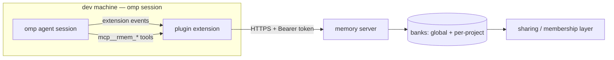

# Repository Guidelines

Greenfield monorepo. Nothing is implemented yet; this document is the
authoritative blueprint and the convention contract for all code that lands
here. When implementation diverges from this file, update this file in the
same commit.

## Project Overview

Remote, portable memory for the **pi agent** (Oh My Pi / `omp` coding agent).
Two deliverables:

1. `plugin/` — an omp plugin that gives agents memory tools (`recall`,
   `retain`, `reflect`, `share`) and session-lifecycle automation
   (auto-recall at session start, auto-retain after turns).
2. `server/` — a remote backend service that stores memories so a user can
   reuse them across machines and **share specific project memory with
   colleagues**.

The memory is *user-owned*, not machine-local: the same knowledge base follows
the user and can be scoped per project or shared per team.

## Architecture & Data Flow



Wire protocol is **MCP over Streamable HTTP** (`type: "http"`), with a plain
REST surface on the same service for non-MCP clients. The plugin integrates on
two surfaces:

- **Extension** (`plugin/src/index.ts`): owns lifecycle automation and
  prefixed agent tools.
- **MCP config** (`plugin/.mcp.json`): points at the backend so tools are also
  reachable as `mcp__rmem_*` in any MCP-capable client.

Data flow per session:

1. `session_start` → extension recalls from the project bank (+ global bank in
   `per-project-tagged` mode) and injects results as background context via
   `before_agent_start`. **Recalled memory is context, not instructions** —
   current user messages and tool output win on conflict (omp convention).
2. Mid-turn → model calls `rmem_recall` / `rmem_retain` / `rmem_reflect` /
   `rmem_share`.
3. `turn_end` → throttled auto-retain (configurable cadence, default every 4
   user turns — mirror `mnemopi.retainEveryNTurns` semantics).
4. `session_shutdown` → bounded drain/flush of pending retains, then close.

Scoping modes (mirror omp's `hindsight` backend exactly):

| mode                 | writes        | recall                          |
| -------------------- | ------------- | ------------------------------- |
| `global`             | shared bank   | shared bank                     |
| `per-project`        | project bank  | project bank only               |
| `per-project-tagged` | project bank  | project bank + global, merged   |

Project bank id derivation must match omp's own scheme: cwd basename + stable
hash of the absolute path (independent of git layout). Sharing = explicit
membership grants on a bank (read or write); **never default-open**.

### Patterns that MUST be followed

- **Best-effort startup**: if the backend is unreachable or auth fails, the
  plugin goes inert and logs — the agent session must keep working. Memory
  tools then report "backend not initialized".
- **Register at load, act in handlers**: extension factories only register;
  runtime actions (`pi.sendMessage`, fetches) happen inside event handlers /
  tool `execute`. Calling actions during load throws.
- **Managed timers only**: any periodic/deferred work uses `ctx.setInterval` /
  `ctx.setTimeout`. Raw `setInterval`/`setTimeout` or detached promises that
  throw tear down the *entire session*.
- **Prefix all tool names** (`rmem_*`): tool names are globally unique in the
  agent registry and must not collide with built-in memory tools
  (`recall`/`retain`/`reflect`/`memory_edit`) exposed when a native memory
  backend is active.
- **Secrets via env only**: `${MEMORY_API_URL}` / `${MEMORY_API_TOKEN}`
  expansion in `.mcp.json`; tokens never in code, config files, logs, or
  retained memory content. Redact common secret patterns before storing
  (omp's local backend does the same).
- **HTTPS/WSS only** for remote endpoints.
- **Abort propagation**: tool `execute` receives `signal`; forward it to every
  `fetch`.
- **Structured `details`**: tool results carry schema-shaped `details` so
  state is reconstructible from tool history.

## Key Directories

Planned layout (monorepo, two workspaces):

```text
plugin/                        # omp plugin package
  package.json                 # omp manifest: "omp": { "extensions": [...] }
  src/index.ts                 # extension factory (default export)
  src/tools/                   # rmem_recall / rmem_retain / rmem_reflect / rmem_share
  src/client/                  # backend HTTP/MCP client (fetch wrapper, auth, retries)
  src/scoping.ts               # bank id derivation + scoping modes
  skills/remote-memory/SKILL.md  # usage guidance; frontmatter needs name+description
  .mcp.json                    # backend server entry, ${MEMORY_API_URL}/${MEMORY_API_TOKEN}

server/                        # remote memory backend
  package.json
  src/index.ts                 # entry: Bun.serve (or Hono) on configurable port
  src/api/                     # HTTP routes + MCP Streamable HTTP endpoint
  src/domain/                  # banks, memories, memberships/sharing, redaction
  src/storage/                 # persistence adapter behind an interface
  migrations/                  # schema migrations
```

Only create directories actually used. No `src/utils` grab-bags.

## Development Commands

```bash
bun install                          # deps (root workspaces)
bun run check                        # tsc --noEmit + oxlint, zero warnings required
bun run fmt                          # oxfmt
bun test                             # vitest (all workspaces)
bun run --cwd server dev             # run backend locally
```

Plugin dev loop (no publish needed):

```bash
omp plugin link ./plugin             # symlinks into ~/.omp/plugins/node_modules
# restart omp, then:
/plugins list                        # verify enabled
omp --extension ./plugin             # one-off load alternative
```

Alternative load paths: `extensions: [./plugin/src/index.ts]` in
`~/.omp/agent/config.yml`, or drop into `~/.omp/agent/extensions/`.
Verify end-to-end in a scratch project: start an omp session, confirm the
`rmem_*` tools appear and a retain→recall round-trip works against
`bun run --cwd server dev`.

Distribution: `omp plugin install github:<user>/<repo>` (git spec), or a
marketplace catalog at `.omp-plugin/marketplace.json`.

## Code Conventions & Common Patterns

Hard limits (apply everywhere):

- Functions ≤100 lines, cyclomatic complexity ≤8, ≤5 positional params
  (use an options object), 100-char lines.
- Absolute imports only — no relative `..` paths; cross-workspace imports use
  the package name.
- Zero warnings: `tsc --noEmit` + `oxlint` must be clean before commit.

TypeScript style:

- ESM only; strict tsconfig (`noUncheckedIndexedAccess`,
  `exactOptionalPropertyTypes`, `verbatimModuleSyntax`, `isolatedModules`,
  `noImplicitOverride`).
- Files kebab-case (`memory-client.ts`), types PascalCase, tool names
  snake_case (`rmem_recall`).
- Tool parameter schemas use **ArkType** (`pi.arktype`) — preferred over Zod
  for new omp tools.
- Extension factory shape:

  ```ts
  import type { ExtensionAPI } from "@oh-my-pi/pi-coding-agent";

  export default function remoteMemory(pi: ExtensionAPI) {
    const { z } = pi.zod; // or pi.arktype for schemas
    pi.on("session_start", async (_event, ctx) => { /* recall */ });
    pi.registerTool({ name: "rmem_recall", /* ... */ });
  }
  ```

Error handling:

- Fail fast with context: what operation, what input, suggested fix. Never
  swallow exceptions; extension handlers must not throw unhandled (caught
  errors go to the extension error channel, not a crash).
- Tool failures return `{ content: [...], isError: true }` shaped for the
  model; transport failures (401, timeout, unreachable) map to distinct
  actionable messages.
- HTTP client is the single place that touches `fetch`; tools never fetch
  directly.

State:

- The plugin is stateless except for the remote backend and optional durable
  extension state via `pi.appendEntry("com.mjaric.remote-memory.state", data)`
  (reverse-domain `customType`; rebuild from `ctx.sessionManager.getBranch()`
  on `session_start`).
- No repo-local cache files, no writing into the user's project.
- Backend config comes from env vars, with settings overridable per plugin
  conventions; absent config → hardcoded defaults + clear log line.

Server-side:

- One HTTP framework, one convention (default: **Hono** on Bun until a reason
  appears); domain logic never imports from `src/api/` upward.
- Storage behind an interface so SQLite (dev) and a durable store (prod) can
  swap; migrations are forward-only.
- Auth: Bearer token per user; bank membership checked on every request —
  authorization lives in the domain layer, not route handlers.

## Important Files

| path                          | role                                                        |
| ----------------------------- | ----------------------------------------------------------- |
| `plugin/src/index.ts`         | extension factory; all registration starts here              |
| `plugin/package.json`         | `omp` manifest (`omp.extensions`, features map)              |
| `plugin/.mcp.json`            | backend MCP entry (`type: "http"`, `${MEMORY_API_URL}`)      |
| `server/src/index.ts`         | service entry point                                          |
| `server/src/domain/`          | banks/memories/sharing — the contract the plugin depends on  |

Reference material (read before designing against the host): omp harness docs
at `omp://extensions.md`, `omp://custom-tools.md`, `omp://mcp-config.md`,
`omp://memory.md`, `omp://mnemosyne-memory-backend.md` (the `hindsight` and
`mnemopi` backends are the behavioral templates for scoping, recall injection,
retain cadence, and shutdown drain).

## Runtime/Tooling Preferences

- **Runtime: Bun ≥ 1.3.14** for both workspaces — omp imports extension
  modules with Bun; the server runs on Bun. Do not rely on Node-only APIs.
  (Node 24 is present on the machine but is not the execution target.)
- **Package manager: bun** (`bun install`, single root lockfile). No npm/yarn
  lockfiles.
- **Lint/format/types**: `oxlint` + `oxfmt` + `tsc --noEmit` (never
  eslint/prettier).
- **New dependencies**: each needs a justification; prefer stdlib (`Bun.serve`,
  `fetch`, `crypto`) first.
- Env var contract (document in README when implemented): `MEMORY_API_URL`,
  `MEMORY_API_TOKEN`; server-side `PORT`, `DATABASE_URL` or equivalent.

## Testing & QA

- Framework: **vitest** under Bun; colocated `*.test.ts` next to sources.
- Test behavior, not implementation; every handled error path gets a test
  (401/403, timeout, unreachable backend, malformed bank id, share-denied).
- Mock boundaries only: network and time. Never mock our own domain logic.
  Backend handler tests use the in-memory storage adapter — no network.
- Deterministic and isolated: tests must not depend on test order, real
  credentials, or a running server.
- Required coverage areas: scoping/bank-id derivation (property-test the
  hashing), redaction of secrets before store, share ACL enforcement,
  retain throttling, shutdown drain under pending writes.
- No coverage threshold gate yet; the bar is "every observable contract and
  every edge the code handles has a failing-test proof".
- Verification loop before claiming done: `bun run check && bun test`, then
  the manual plugin dev-loop round-trip above. CI does not exist yet — add it
  with the first working server.
