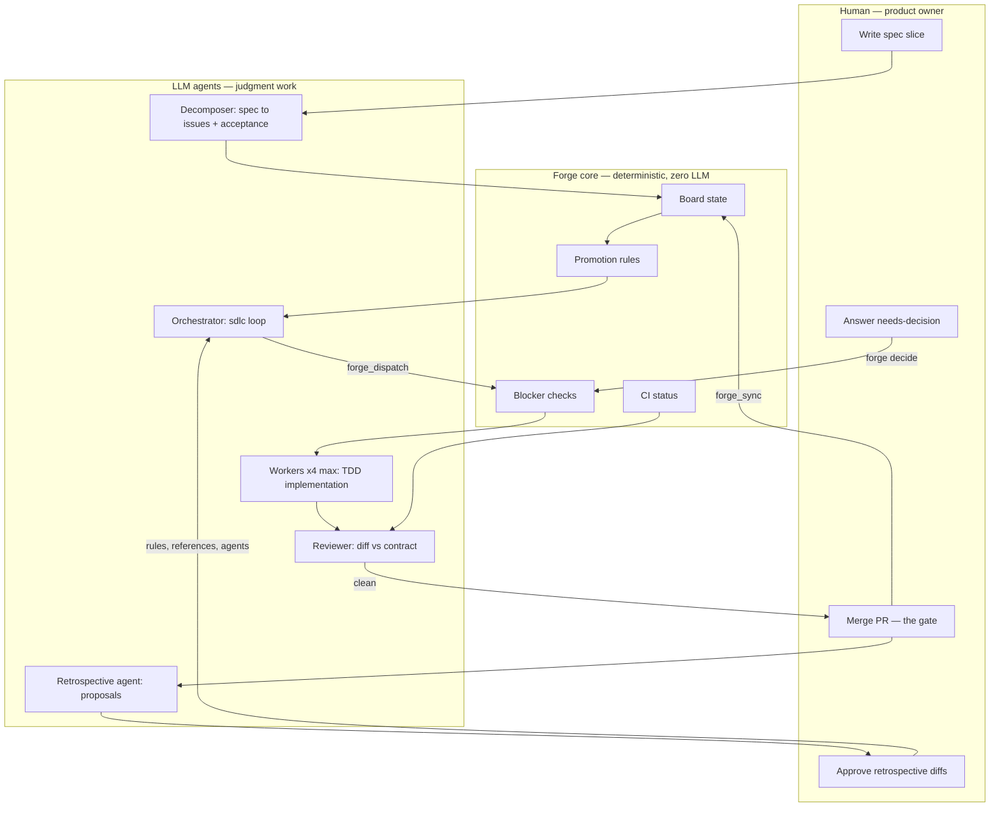
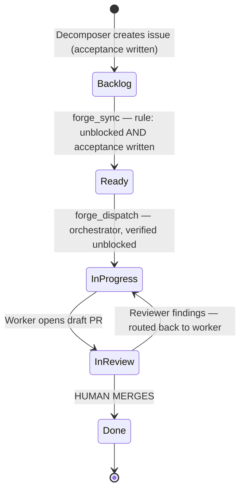
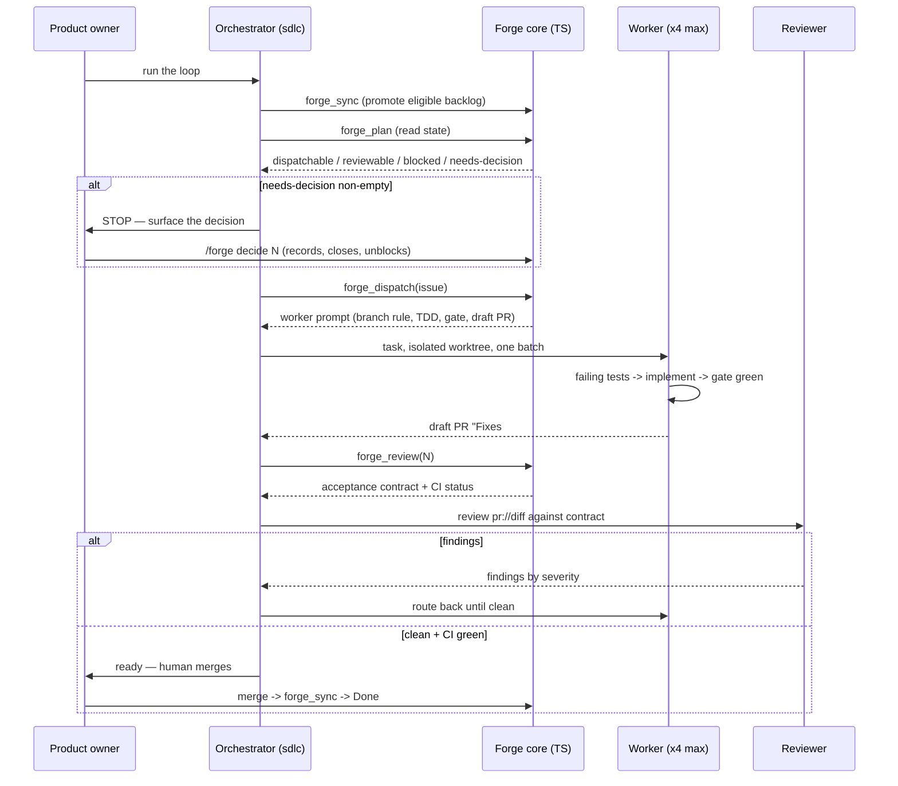
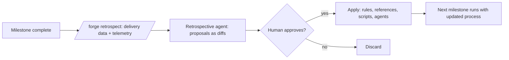

# Forge SDLC — Organizational Model

Business/organizational view of the forge-driven SDLC: who does what, who
decides what, and where the hard gates are. The companion `README.md` covers
installation and commands; this document covers **roles, authority, and flow**.

## 1. Governance in one paragraph

Forge turns a spec-driven repository into a self-driving delivery pipeline with
a **human gate at the merge boundary**. Process rules (blockers, promotions,
dispatch eligibility) are enforced deterministically in TypeScript — zero LLM
involvement, zero tokens, fully auditable. Judgment work (decomposing specs,
writing code, reviewing diffs, proposing process improvements) is delegated to
LLM agents. The human keeps four exclusive powers: the spec, decisions,
merges, and approval of process changes.

## 2. Actors

| Actor | Type | Responsibility | May change | Never does |
|---|---|---|---|---|
| **Product owner** (human) | Human | Owns the spec; answers `needs-decision` issues; merges PRs; approves process changes | Spec, decisions, `main` (via merge), process rules | Writes code in the loop |
| **Orchestrator** (`sdlc` skill, lead agent) | LLM agent | Runs the loop: sync → plan → dispatch (≤4 workers) → review → repeat; stops on milestone/idle/decision | Board transitions via forge tools; spawns workers/reviewers | Guesses past a decision; merges; calls `gh` for board logic |
| **Decomposer** (`/forge decompose`) | LLM task | Turns a spec slice into GitHub issues with written acceptance criteria (test names) and blockers | Issues + acceptance checklists | Implementation |
| **Worker** (`task` agent, isolated worktree) | LLM agent | TDD implementation of one issue: failing tests first, gate passes, draft PR `Fixes #N` | Own branch `impl/N-slug` only | Touches `main`; skips the gate; opens non-draft PRs |
| **Reviewer** (`reviewer` agent) | LLM agent | Checks the diff against the acceptance contract; reports findings by severity | Nothing — read-only | Approves merges |
| **Retrospective agent** (`forge-retrospect` skill) | LLM agent | Turns milestone data + telemetry into proposed improvements (diffs to rules/references/scripts/agents) | Proposals only | Applies anything without approval |
| **Forge core** (plugin TypeScript) | Deterministic machinery | Board state, blocker checks, promotions, dispatch verification, CI status, review contract assembly, auth, doctor | Board card moves — strictly per rules | Anything requiring judgment |

Organizational point: the forge core is the **process-enforcement layer**. It
refuses (without touching the board) when blockers are open, so policy cannot
be bypassed by a persuasive prompt.

## 3. End-to-end lifecycle

## 4. Issue lifecycle on the board

The board (GitHub Projects v2, Status field) is the single source of truth.
Every transition has exactly one trigger owner:

Notes:

- **Blocked is a relationship, not a status.** An issue in any status with an
  open blocker (native GitHub "blocked by" or `Blocked by #N` in the body) is
  ineligible for dispatch and promotion.
- **Acceptance checklists are the contract.** Written with test names at
  decompose time, unchecked until implemented, verified at review time.
- Promotion is a mechanical rule, not a judgment call — no LLM involved.

## 5. One round of the loop

## 6. RACI by stage

R = Responsible (does the work), A = Accountable (owns the outcome),
C = Consulted, I = Informed.

| Stage | Product owner | Orchestrator | Decomposer | Worker | Reviewer | Forge core |
|---|---|---|---|---|---|---|
| Write spec slice | **A/R** | — | C | — | — | — |
| Decompose into issues | A (approves) | C | **R** | — | — | I (adds to board) |
| Backlog → Ready | I | C (triggers sync) | — | — | — | **R** (applies rule) |
| Resolve decision | **A/R** | I (surfaces) | — | — | — | I (records) |
| Dispatch | I | **A** | — | I | — | **R** (verify + move) |
| Implement (TDD) | I | A (coordinates) | — | **R** | — | I (gate check) |
| Review PR | I | A (routes findings) | — | C (fixes) | **R** | R (contract + CI) |
| Merge | **A/R** | I | — | — | — | I (card → Done) |
| Retrospective | **A** (approves) | I | — | — | — | R (collects data) |

Exactly one accountable party per stage; the human is accountable at the
four gates (spec, decision, merge, process change) and informed everywhere
else.

## 7. Control gates

| Gate | Owner | What it enforces |
|---|---|---|
| **Promotion gate** | Forge core (rule) | Nothing reaches Ready without zero open blockers and a written acceptance section |
| **Dispatch gate** | Forge core (rule) | Only Ready, unblocked issues are dispatched; refusal is silent-proof (board untouched) |
| **Quality gate** | Worker + CI | Configured `gate` commands pass with zero warnings before a PR exists |
| **Review gate** | Reviewer agent | Every acceptance criterion has a real test; no stubs/placeholders |
| **Merge gate** | **Human** | Forge never merges or pushes to main; a PR waits for the owner |
| **Decision gate** | **Human** | Any `needs-decision` issue halts the loop; agents never guess past it |
| **Process-change gate** | **Human** | Retrospective proposals are diffs; nothing applies without approval |
| **Concurrency ceiling** | Orchestrator | At most 4 workers in flight per round |

## 8. Two control surfaces, one mechanism

The same loop modules serve both seams, so a human can intervene at any point
without leaving the model:

- **Slash commands** (`/forge plan`, `/forge dispatch N`, `/forge review N`,
  `/forge round`, `/forge decide N …`) — human-invoked.
- **Agent tools** (`forge_plan`, `forge_sync`, `forge_dispatch`,
  `forge_review`) — called mid-turn by the `sdlc` skill to run autonomously.

Organizational consequence: autonomy is a dial, not a mode. The owner can run
the loop fully hands-off and still drop into any stage with a command.

## 9. Self-improvement loop (opt-in)

Improvement targets, in priority order: loop rules
(`.omp/skills/sdlc/rules/`), learned references
(`.omp/skills/sdlc/references/`), helper scripts, and new agents/roles —
each proposal grounded in observed evidence (findings, PR numbers, retry
stats). "No changes needed" is a valid outcome.

## 10. Cost model

Mechanical work (board reads/writes, blocker checks, promotion, CI status)
runs in plain TypeScript at zero LLM tokens. Tokens are spent only on the four
judgment tasks: decompose, dispatch (code writing), review, retrospective.
This makes per-milestone cost predictable and proportional to genuine
reasoning, not to process overhead.
